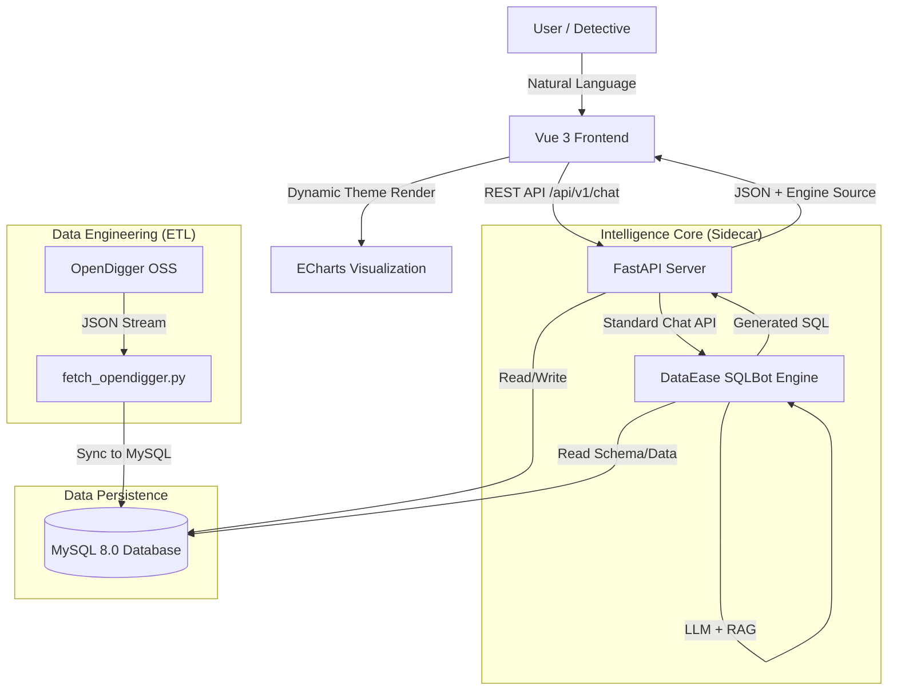

# Open-Detective Architecture & Design

## 1. System Overview
Open-Detective is a **Text-to-SQL** application designed to lower the barrier for exploring OpenDigger data. It utilizes the **DataEase SQLBot** engine to bridge the gap between natural language questions and MySQL-stored metrics.

### Key Value Proposition
- **For OSPO**: Detect risks (low bus factor, high issue backlog) without writing complex SQL.
- **For Developers**: Quickly visualize trends of 50+ global top-tier OSS projects.

## 2. Architecture Diagram

## 3. Component Details

### 3.1 Data Layer (The Source of Truth)
- **Source**: [OpenDigger](https://github.com/X-lab2017/open-digger) static data via OSS CDN.
- **Storage**: MySQL 8.0.
- **Optimization**: Indexed by `(repo_name, metric_type)` for sub-millisecond query performance.
- **ETL**: `data/etl_scripts/fetch_opendigger.py` handles multi-repo batch ingestion with automatic retries.

### 3.2 Backend Layer (The Orchestrator)
- **Framework**: FastAPI (Python).
- **Engine Factory**: A modular pattern that allows switching between `Mock` (rule-based) and `SQLBot` (AI-based) engines via `.env`.
- **Hot-Reloading**: Automatically detects updates to `SQLBOT_API_KEY` without container restarts.
- **Resilience**: Built-in MySQL connection retry logic to handle Docker startup race conditions.

### 3.3 Intelligence Engine (The Brain)
- **Engine**: [DataEase SQLBot](https://github.com/dataease/SQLBot).
- **Integration**: Communicates via standard `chat/start` and `chat/question` endpoints using a JWT-based `X-SQLBOT-TOKEN`.
- **RAG Context**: Includes a business glossary (`data/sql/sqlbot_glossary.md`) to help the LLM understand domain-specific metrics like OpenRank and Bus Factor.

### 3.4 Frontend Layer (The Face)
- **Framework**: Vue 3 + TypeScript + Vite.
- **UI Design**: Multi-theme support (Cyberpunk, Minimalist, Ocean).
- **Features**:
    - **In-place Copy**: Smooth feedback for SQL copying.
    - **Dynamic Visualization**: Theme-aware ECharts integration.
    - **Case Export**: Client-side Markdown report generator.

## 4. Port Mapping Summary
- **Frontend**: 8082
- **Backend**: 8081
- **SQLBot**: 8000 (UI/API), 8001 (Admin)
- **MySQL**: 3306
