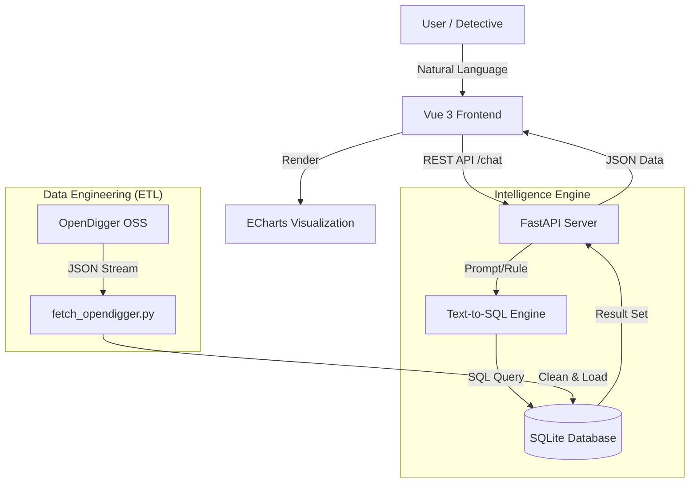

# Open-Detective Architecture & Design

## 1. System Overview
Open-Detective is a **Text-to-SQL** application designed to lower the barrier for exploring OpenDigger data. It bridges the gap between natural language questions and structured OSS metrics.

### Key Value Proposition
- **For OSPO**: Detect risks (low bus factor, high issue backlog) without writing complex SQL.
- **For Developers**: Quickly visualize trends of upstream dependencies.

## 2. Architecture Diagram

## 3. Component Details

### 3.1 Data Layer (The Foundation)
- **Source**: [OpenDigger](https://github.com/X-lab2017/open-digger) static data via OSS CDN (`https://oss.x-lab.info/open_digger/github/...`).
- **Storage**: SQLite (`open_detective.db`).
- **Schema**: `open_digger_metrics` table containing:
    - `repo_name`: e.g., 'vuejs/core'
    - `metric_type`: 'stars', 'activity', 'openrank', 'bus_factor', 'issues_new', 'issues_closed'
    - `month`: 'YYYY-MM'
    - `value`: Numerical value
- **ETL**: `data/etl_scripts/fetch_opendigger.py` handles fetching, validation, and upserting data.

### 3.2 Backend Layer (The Brain)
- **Framework**: FastAPI (Python).
- **Core Logic**:
    - **`mock_text_to_sql`**: Currently a rule-based engine mapping keywords (e.g., "risk", "bus") to SQL queries. *Future: Replace with LLM (Gemini/DeepSeek).*
    - **API**: `/api/chat` endpoint handles the conversation lifecycle.

### 3.3 Frontend Layer (The Face)
- **Framework**: Vue 3 + TypeScript + Vite.
- **UI Design**: Cyberpunk/Dark-themed "Detective Dashboard".
- **Visualization**: `ResultChart.vue` dynamically selects Line/Bar charts based on data shape.
- **Export**: Generates Markdown reports client-side for data portability.

## 4. Future Roadmap
1.  **LLM Integration**: Replace the rule-based `mock_text_to_sql` with a real LLM API to support complex queries (e.g., "Compare Vue and React growth in 2023").
2.  **Schema Linking**: Feed table schema to LLM for higher SQL accuracy.
3.  **Cross-Repo Analysis**: Enable queries that join data from multiple repositories.
4.  **Anomaly Detection**: Auto-highlight data points that deviate significantly from the trend.